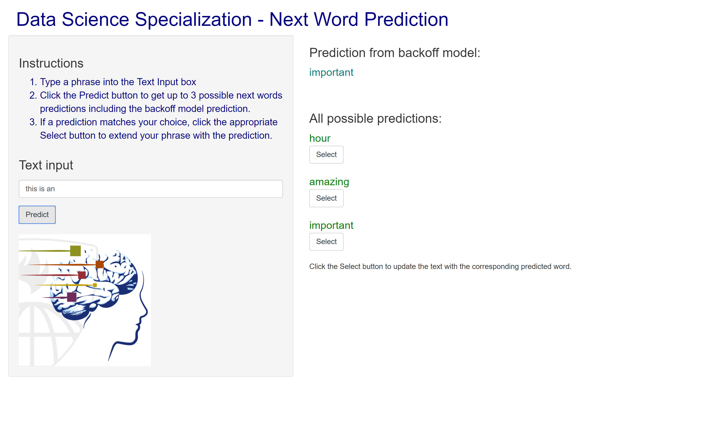

```{r setup, include=FALSE}
knitr::opts_chunk$set(echo = FALSE)
```

## **Motivation** for Next Word Prediction {.smaller}


<div class="columns-2">

 
In **Natural Language Processing** it is valuable to be able to predict the next word. This starts with assigning probabilities to words, phrases or sentences. 
 
- **Speech Recognition**: It helps to know more probable sentences to decode a garbled speech audio input

- **Spelling or Grammar Correction**: Detecting an unlikely phrase can identify potential mistakes in the text

- **Machine Translation**: Known sentence probabilities can be used to reconstruct translations into the target language.


</div>

## **Approach** : Prediction Model

The goal is to use **probabilistic language modeling** to compute the probability of upcoming words and fill in the most probable option.

To compute the probability of a sequence of words, we use the **Chain Rule of Probability** along with the simplifying **Markov Assumption**.
Instead of calculating the probability of the next word given all of the preceding words, we approximate this using only a few preceding words. 

**N-gram model** uses N-1 words to approximate the Nth word.

If the N-gram has zero counts, then the **backoff model** allows to approximate using the (N-1)-gram. 


## **Approach** : Learning from Sample Texts


1. Gather training data set using sample texts from twitter, news and blogs. Generate a **corpus**. 
2. Clean the corpus by removing numbers, bad words and punctuations
3. **Tokenize** the clean corpus into words
4. Convert the tokens into **n-grams**, pairs of n words that appear in sequence in the corpus
5. Create a **document feature matrix** to generate a table of n-grams and their corresponding frequency in the corpus


## How to Use the [App]( https://bbamini.shinyapps.io/Shiny/)? {.smaller}

1. Write phrases in the text box and press "Predict". 
2. Backoff model prediction will display in the main panel along with other predictions made using shorter N-grams.
3. The input text can be updated by selecting a predicted word.

<center>

</center>